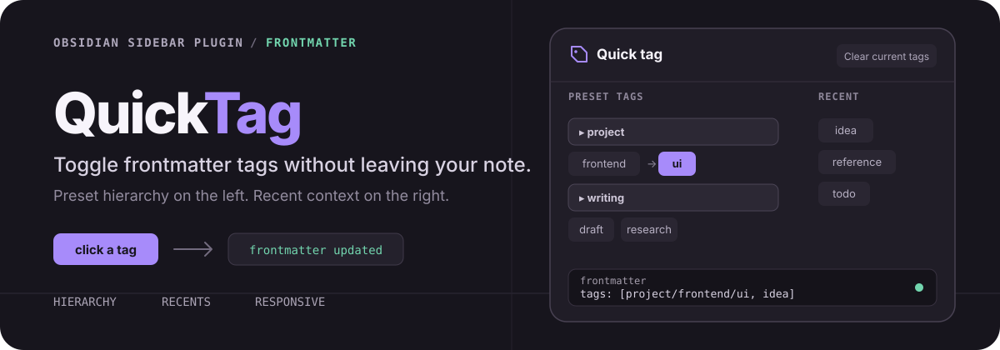
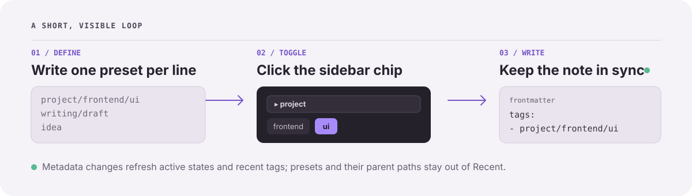

<h1 align="center">
  
</h1>

<p align="center">
  <a href="./README.zh-CN.md">中文</a> ·
  <a href="https://github.com/lumiarna/quick-tag/releases/latest">Latest release</a> ·
  <a href="./LICENSE">MIT license</a>
</p>

Quick Tag keeps repetitive tag editing in the Obsidian sidebar. Define the tags you use, group them with slash-separated paths, and click a chip to add or remove it from the active note.

## One click, one frontmatter update

Start with a note like this:

```yaml
---
tags:
  - notes
---
```

Click `project/frontend/ui` in the Quick Tag panel. The chip becomes active and the note becomes:

```yaml
---
tags:
  - notes
  - project/frontend/ui
---
```

No command palette round-trip and no manual YAML editing.

## What stays close at hand

- **Preset hierarchy** — write one tag per line and use `/` to group related paths.
- **Recent context** — newly added note tags are tracked newest-first; preset tags and their parent paths are filtered out.
- **Visible state** — tags already present in the active note are highlighted in the panel.
- **Focused controls** — clear all frontmatter tags from the current note in one action.
- **Compact-window support** — the two-column panel collapses to one column in narrow app layouts.

## How it works

<p align="center">
  
</p>

Quick Tag uses Obsidian's frontmatter API for tag toggles. Metadata changes refresh the active chips and feed the recent-tag list, which can hold between 5 and 50 items.

## Install

### From a release

1. Download `main.js`, `manifest.json`, and `styles.css` from the [latest release](https://github.com/lumiarna/quick-tag/releases/latest).
2. Create this directory inside your vault:

   ```text
   <your-vault>/.obsidian/plugins/quick-tag/
   ```

3. Put the three files in that directory.
4. Reload Obsidian, then enable **Quick Tag** under **Settings → Community plugins**.

### Build from source

```bash
git clone https://github.com/lumiarna/quick-tag.git
cd quick-tag
npm install
npm run build
```

Copy `main.js`, `manifest.json`, and `styles.css` to the same plugin directory, then enable the plugin in Obsidian.

> Requires Obsidian 1.4.0 or later.

## First use

1. Open **Settings → Community plugins → Quick Tag**.
2. Add one preset tag per line. Use `/` for hierarchy:

   ```text
   project/frontend/ui
   project/backend/api
   writing/draft
   ```

3. Run **Show tag panel** from the command palette. The panel also opens automatically after the workspace layout is ready.
4. Click any preset or recent tag to toggle it in the active note.

The settings page also lets you set the recent-tag limit or clear recent history. The panel toolbar clears all frontmatter tags from the active note.

## Behavior notes

- Tag toggles are written to frontmatter `tags` as an array.
- Active highlighting is based on the current note's frontmatter tags.
- Recent tags are collected from Obsidian metadata updates, including frontmatter and inline tag additions.
- Preset and recent tag values normalize leading `#` characters and extra slash-path whitespace.

<details>
<summary><strong>Development and release workflow</strong></summary>

### Commands

```bash
npm run dev
npm run build
npm run lint
```

### Release

Use npm to keep `package.json`, `manifest.json`, and `versions.json` in sync:

```bash
npm version patch
git push --follow-tags
```

The release workflow checks that the Git tag matches the package and manifest versions and exists in `versions.json`. It then builds the plugin and publishes `main.js`, `manifest.json`, and `styles.css` as release assets. The repository's `.npmrc` removes npm's default `v` tag prefix.

</details>

## License

[MIT](./LICENSE)
