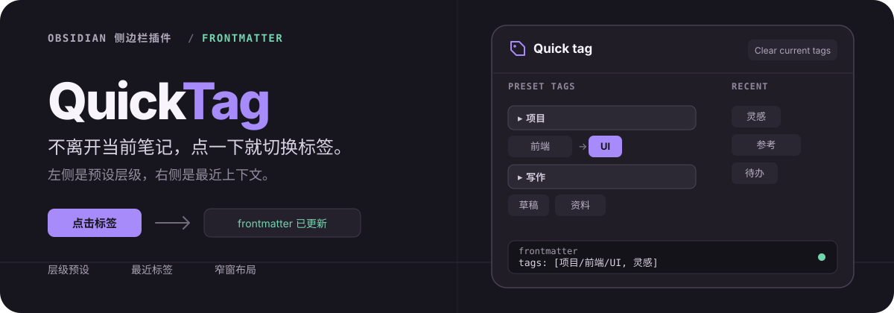
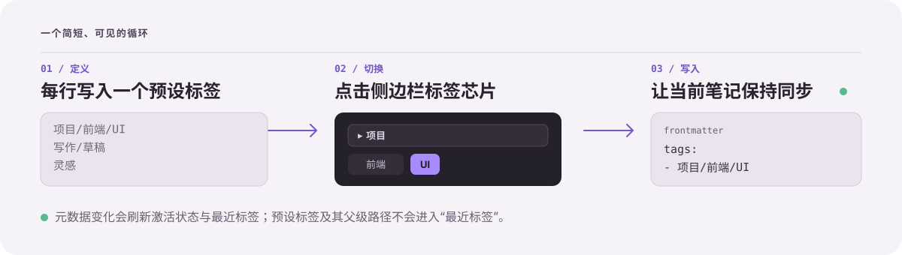

<h1 align="center">
  
</h1>

<p align="center">
  <a href="./README.md">English</a> ·
  <a href="https://github.com/lumiarna/quick-tag/releases/latest">最新版本</a> ·
  <a href="./LICENSE">MIT 许可证</a>
</p>

Quick Tag 把重复的标签编辑留在 Obsidian 侧边栏里。预先定义常用标签，用斜杠路径整理层级，然后点击标签芯片，即可为当前笔记添加或移除标签。

## 点一下，frontmatter 就更新

假设笔记最初是：

```yaml
---
tags:
  - notes
---
```

在 Quick Tag 面板中点击 `项目/前端/UI`。芯片会进入激活状态，笔记随即变为：

```yaml
---
tags:
  - notes
  - 项目/前端/UI
---
```

不必反复打开命令面板，也不必手动编辑 YAML。

## 常用标签始终触手可及

- **预设层级**：每行写入一个标签，用 `/` 组织关联路径。
- **最近上下文**：新增标签按时间倒序记录；预设标签及其父级路径会被过滤。
- **状态可见**：当前笔记已有的 frontmatter 标签会在面板中高亮。
- **专注操作**：可一次清空当前笔记的全部 frontmatter 标签。
- **窄窗口适配**：应用窗口较窄时，双栏面板会自动切换为单栏。

## 工作方式

<p align="center">
  
</p>

Quick Tag 通过 Obsidian 的 frontmatter API 切换标签。元数据变化会刷新标签芯片状态，并更新最近标签列表；列表上限可设为 5～50 条。

## 安装

### 从 Release 安装

1. 从[最新版本](https://github.com/lumiarna/quick-tag/releases/latest)下载 `main.js`、`manifest.json` 和 `styles.css`。
2. 在仓库中创建目录：

   ```text
   <你的仓库>/.obsidian/plugins/quick-tag/
   ```

3. 将三个文件放入该目录。
4. 重新加载 Obsidian，然后前往 **设置 → 第三方插件** 启用 **Quick Tag**。

### 从源码构建

```bash
git clone https://github.com/lumiarna/quick-tag.git
cd quick-tag
npm install
npm run build
```

将生成的 `main.js` 连同 `manifest.json`、`styles.css` 复制到同一个插件目录，然后在 Obsidian 中启用插件。

> 需要 Obsidian 1.4.0 或更高版本。

## 第一次使用

1. 打开 **设置 → 第三方插件 → Quick Tag**。
2. 每行添加一个预设标签，并用 `/` 表示层级：

   ```text
   项目/前端/UI
   项目/后端/API
   写作/草稿
   ```

3. 在命令面板中运行 **Show tag panel**。工作区布局就绪后，面板也会自动打开。
4. 点击任意预设标签或最近标签，即可在当前笔记中切换它。

设置页还可以调整最近标签数量或清空最近记录；面板工具栏可以清空当前笔记的全部 frontmatter 标签。

## 行为说明

- 标签会以数组形式写入 frontmatter 的 `tags` 字段。
- 激活高亮以当前笔记的 frontmatter 标签为准。
- 最近标签来自 Obsidian 的元数据更新，包括 frontmatter 与行内标签新增。
- 预设标签和最近标签会规范化开头的 `#` 与斜杠路径两侧的多余空格。

<details>
<summary><strong>开发与发布流程</strong></summary>

### 常用命令

```bash
npm run dev
npm run build
npm run lint
```

### 发布

通过 npm 升级版本，使 `package.json`、`manifest.json` 和 `versions.json` 保持同步：

```bash
npm version patch
git push --follow-tags
```

发布工作流会校验 Git tag 与 package、manifest 版本一致，并确认它存在于 `versions.json` 中；随后构建插件，将 `main.js`、`manifest.json`、`styles.css` 作为 Release 附件发布。仓库中的 `.npmrc` 已移除 npm 默认的 `v` tag 前缀。

</details>

## 许可证

[MIT](./LICENSE)
